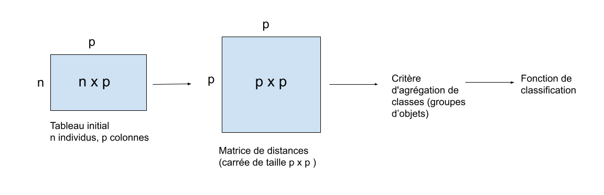
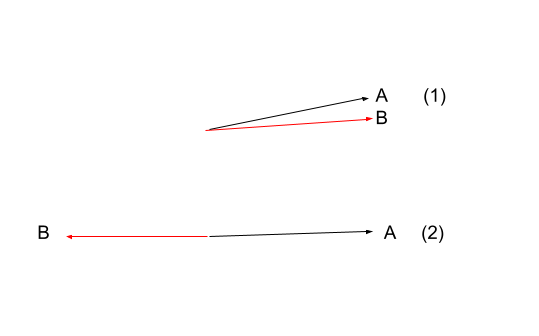

On cherche à réaliser la classification de variables issus du jeu de données “décathlon” (FactoMineR) en utilisant uniquement 10 premières variables du jeu de données, et par calcul matriciel uniquement.

On se questionne donc sur la notion de distances entre les objets.

La distance entre deux variables doit pouvoir mettre en évidence que deux variables sont proches l’une de l’autre, ou que deux variables sont éloignées l’une de l’autre. Les variables étant des mesures sur les individus, si deux variables sont proches, alors, les valeurs prises par les individus sur ces deux variables reflètent une proximité entre ces variables.

```{r, echo=F}

```

``` {r, echo=F}

```

Les variables A et B sont-elles proches dans la situation 1 ? Oui, car les valeurs prises par les individus pour la variable A et pour la variable B se comportent de la même manière : les individus qui ont tendance à prendre des fortes valeurs pour la variable A ont tendance à prendre aussi des fortes valeurs pour la variable B (ou de faibles valeurs,.... ). Et dans la situation 2?

Dans la situation 2, les individus qui vont avoir tendance à prendre des fortes valeurs pour la variable B prendront plutôt des faibles valeurs sur la variable A, et inversement. On peut considérer que l’information transmise par ces deux variables peut être représentée de façon unidimensionnelle (par exemple : A : faire bcp de sport, B : ne pas faire de sport) et donc que l’opposition entre les variables A et B traduit une proximité entre elles.

Pour traduire cette distance entre les variables, on peut calculer la matrice des covariances de p (matrice de variance covariance) :

$$
\operatorname{Cov}(X, Y) =
\frac{\sum_{i=1}^{N} (x_i - \bar{x})(y_i - \bar{y})}{n}
$$

Comme Cov(X,X) = Var(X) ; en diagonale de la matrice de variance-covariances se trouvent les variances des variables 1 à n :

$$
V =
\begin{pmatrix}
V(X_1) & \operatorname{Cov}(X_1, X_2) & \cdots & \operatorname{Cov}(X_1, X_n) \\
\operatorname{Cov}(X_2, X_1) & V(X_2) & \cdots & \operatorname{Cov}(X_2, X_n) \\
\vdots & \vdots & \ddots & \vdots \\
\operatorname{Cov}(X_n, X_1) & \operatorname{Cov}(X_n, X_2) & \cdots & V(X_n)
\end{pmatrix}
$$

A partir de cette matrice V, on peut calculer la matrice des p (coefficients de corrélation de pearson), en pondérant par la diagonale de la matrice de variance - covariance (pondération par le produit des racines carrées des variances).

La formule de la corrélation étant : $$
\rho(X, Y)
= 
\frac{\sum (X - \bar{X})(Y - \bar{Y})}
       {\sqrt{\sum (X - \bar{X})^{2}} \, \sqrt{\sum (Y - \bar{Y})^{2}}}
=
\frac{\operatorname{Cov}(X, Y)}
     {\sqrt{V(X)} \, \sqrt{V(Y)}}
$$

X et Y : deux variables aléatoires

$\bar{X}$ et $\bar{Y}$: moyennes respectives des variables X et Y

$\operatorname{Cov}(X, Y)$ : Covariance entre X et Y

$V(X)$ et $V(Y)$ : Variances respectives de X et Y

On obtient la matrice des coefficients de corrélation. On passe ensuite tous les éléments de cette matrice au carré, pour obtenir des coefficients de corrélation entre 0 et 1. 

Pour obtenir la matrice des distances, on crée la matrice des (1 - p²) :
Si on s’intéresse à une variable X et une autre variable X’, si X = X’, alors leur p² est de 1 donc leur distance dx’x est de 0 : deux variables identiques sont en effet confondues donc aucunement distantes. 
Plus la distance entre deux variables X et X’ est importante, plus la valeur au croisement de X et X’ dans la matrice des distances est proche de 1.  

Cette matrice de distance de taille p x p permettra ensuite de réaliser la classification des variables à partir du critère d’agrégation défini. 

Nous allons voir la mise en oeuvre avec le jeu de données "décathlon".

## Récupération des données

```{r}
library(FactoMineR)
data("decathlon")
data <- decathlon
data <- data[,1:10]

summary(data) 
```

Calcul du vecteur des moyennes 

```{r}
moy_matr <- matrix(1, nrow = nrow(data), ncol = ncol(data) ) # construction de la matrice des moyennes de dimension n (41) x p (10)

# transforme data en matrice 
data <- as.matrix(data)

# création de la matrice NxP des moyennes 
for (i in 1:nrow(data)) {
  moy_col <- colMeans(data) #  récupération des moyennes par colonne de data 
  moy_matr[i,] <- moy_col   #  chaque colonne p(i) contient la moyenne de la colonne  i 
}

# Création de la matrice X centrée => X_Centrée = X (=data) - X_moyenne (=moy_matr)
X_centree = data - moy_matr

# test : data[1,1] - 11

X_centree # dim N * P 
```

Calcul de la Matrice des Variances covariance X'X

```{r}
# Initialisation de la matrice des var covariance : de dim p x p 
varcov_matr <- matrix(1, nrow = ncol(data), ncol = ncol(data))

get.covariance <- function (x1, x2, X) {
  # x1: variable 1 (n° col de X)
  # x2 : variable 2 (n° de col de X)
  # X : matrice centrée 
  
  cov = 0
  sum = 0

  for (i in 1:nrow(X)) {
    sum = sum + (X[i,x1] * X[i,x2])
    # print(sum)
  }
  
  cov = sum/(nrow(X)-1) 
  return(cov)
}
```

####################################################### 

test de la formule

```{r}
# Test de la formule : avec cov(X1,X1)
res <- get.covariance(x1 = 1, x2 = 1, X = X_centree)
res # 0.0691811

# variance de la variable "100m" 
var(X_centree[,1]) # 0.0691811
cov(X_centree[,1], X_centree[,1]) # 0.0691811


# Test de la formule avec cov(X1,X2)
res <- get.covariance(x1 = 1, x2 = 2, X_centree)
res # -0.0498225

cov(X_centree[,1], X_centree[,2]) # [1] -0.0498225
```

####################################################### 

```{r}
# Remplissage de la matrice 

for (i in 1:ncol(X_centree)) {
  for(j in 1:ncol(X_centree)){
    
    varcov_matr[i,j] <- get.covariance(x1 = i, x2 = j, X_centree)
  }
}

dim(varcov_matr)

varcov_matr

```

<!-- Pondération de la matrice centrée par la racine carrée de la diagonale de la matrice de variance - covariance  -->

On a obtenu la matrice des covariances, qui contient dans sa trace (diagonale), les variances des variables 1 à 10.

On va calculer à partir de cette matrice la matrice des r (coefficients de corrélation de Pearson) par la formule :

p(x,y) = cov / (sqrt(x) \* sqrt(y))

```{r}
# Calcul de la matrice des r 

coeff_cor <- matrix(0, nrow = 10, ncol = 10)

for (i in 1:ncol(varcov_matr)) {
  for (j in 1:ncol(varcov_matr)) {
    

  
    coeff_cor[i,j] <- varcov_matr[i,j] / (sqrt(varcov_matr[i,i]*varcov_matr[j,j]))

    
  }
}
coeff_cor

# il y a bien des 1 en diagonales : coeff de corrélation de 1 entre une variable et elle meme 

# test cor(x1,x2)
# cor(X_centree[,1], X_centree[,2]) 

```

Calcul de la matrice des r² : Carré de la matrice 'coeff_cor'

```{r}
coeff_cor <- coeff_cor^2
```

Calcul de la matrice de distance: (1 - r²)

```{r}
dist_matr <- 1-coeff_cor
dist_matr
```

Nous avons donc pu calculer la matrice des distances, correspondant à la matrice des 1-r² (r² = coefficients de corrélation)

Deux variables sont d'autant plus proches que leurs coefficients de distances sont proches. Deux variables identiques ont une corrélation de 1, et sont donc complètement confondues, il y a entre elles une distance nulle.

## Procédure par calcul matriciel 
```{r}
X <- as.matrix(decathlon[,1:10])
n <- nrow(X)
p <- ncol(X)

# 1) Centrage
moy <- colMeans(X)
moy_mat <- matrix(1, n, 1) %*% t(moy) 
moy_mat
X_centree <- X - moy_mat

# Vérification du centrage
colMeans(X_centree)

# 2) Matrice Variance-Covariance par produit matriciel
varcov_matr <- (t(X_centree) %*% X_centree) / (n - 1)

# Vérification
all.equal(varcov_matr, cov(X))

# 3) Matrice de Corrélation par standardisation matricielle
ecarts_types <- sqrt(diag(varcov_matr))
D_inv <- diag(1/ecarts_types)
coeff_cor <- D_inv %*% varcov_matr %*% D_inv

# Vérification
all.equal(coeff_cor, cor(X))

# 4) Matrice r² puis matrice des distances
coeff_cor2 <- coeff_cor^2
dist_matr2 <- 1 - coeff_cor2

# Nom des lignes / colonnes
names <- colnames(X)
rownames(dist_matr2) <- names
colnames(dist_matr2) <- names

dist_matr2
```

Comparaison avec la première matrice de distance
```{r}
dist_matr
```


## Clustering des variables

```{r}
# on change le nom des cols et des rows 
names <- names(decathlon)[1:10]
colnames(dist_matr)<- names
rownames(dist_matr)<- names
```

PCA de la matrice de distance

```{r}
res.pca <- PCA(dist_matr)
```

Avec la PCA sur la matrice des distances entre les variables du jeu de données (interprétées comme des individus), on peut voir qu'il y a 3 clusters distincts de variables. On peut réaliser une classification ascendante hierarchique (HCPC) à partir afin de séparer les variables en 3 clusters.

```{r}
HCPC(res.pca, nb.clust = 3)
```

Les clusters identifiés sont : - 400 m, long jump, 110 m hurdle [110 m haies], 100 m - high jump [saut en hauteur], discus [lancer de disque], shot put [lancer de poids] - 1500 m, pole vault [saut à la perche], javeline [lancer de javelot]

Interprétation des clusters : Les clusters regroupent des variables (épreuves de décathlon) qui se ressemblent, c'est-à-dire pour lesquelles les mêmes individus obtiennent des résultats similaires. Les individus réussissent similairement sur des épreuves similaires pour leur profil sportif, ce qui permet de regrouper les épreuves ensemble par similarité entre elles.

Le cluster 1 regroupe les épreuves de 400 m, saut en longueur, 100 m et 110 m haies. Ces épreuves sont des épreuves de vitesse et ce qui peuvent les rassembler ce sont qu'elles sont bien réussies par des sportifs vifs, impulsifs, ce sont des épreuves de vitesse / explosivité, car elles requièrent une vitesse explosive et une puissance anaérobie.

Le cluster 2 regroupe les épreuves de saut en hauteur, lancer de disque, lancer de poids. Ce sont des épreuves qui nécessitent de la force explosive, de la puissance du haut du corps et de la coordination technique.

Le cluster 3 regroupe les épreuves de 1500 m, de saut à la perche et de lancer de javelot. Le 1500 m est une épreuve d'endurance et 2 autres sont des épreuves qui requièrent une technique complexe, de la coordination et une certaine souplesse. Ce cluster regroupe des épreuves 'atypiques' du décathlon, la perche et le javelot faisant appel à des compétences très spécifiques. Ce cluster peut donc regrouper des sportifs au profil plus complet.
